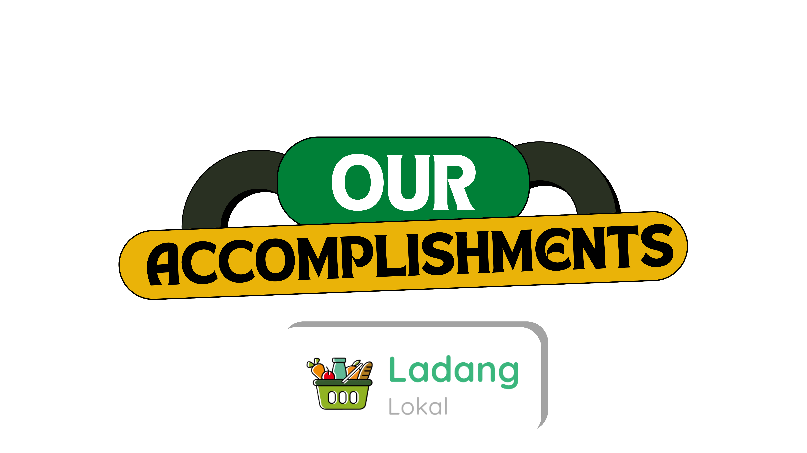

<p align="center">
 
</p>
<p align="center">
 
 <h2 align="center">Stay Tuned for The Subtle Reveal of Our Application</h2>
 <p align="center">Get dynamically generated "Ladang Lokal" stats on very demure and very mindful!</p>
</p>
<p align="center">
    <a href="https://github.com/grandiv/tugas-akhir-paw-kel-12/graphs/contributors">
       
    </a>
</p>

<p align="center">
 <p align="center">Ladang Lokal adalah Web App yang berbasis e-commerce sehingga pengguna dapat melakukan transaksi berupa pembelian terkait kebutuhan sehari-hari khususnya pangan🥦🍎 </p>
 <p align="center">Website kamu hanya mengambil supplier Lokal Yogyakarta untuk membantu kesejahteraan UMKM lokal 🤩</p>
</p>

# Docummentation ✍️
1. [PPT]()
2. [Video]()
3. [Website]()

This is a [Next.js](https://nextjs.org) project bootstrapped with [`create-next-app`](https://nextjs.org/docs/app/api-reference/cli/create-next-app).

## Getting Started

First, run the development server:

```bash
npm run dev
# or
yarn dev
# or
pnpm dev
# or
bun dev
```

Open [http://localhost:3000](http://localhost:3000) with your browser to see the result.

You can start editing the page by modifying `app/page.tsx`. The page auto-updates as you edit the file.

This project uses [`next/font`](https://nextjs.org/docs/app/building-your-application/optimizing/fonts) to automatically optimize and load [Geist](https://vercel.com/font), a new font family for Vercel.

## Learn More

To learn more about Next.js, take a look at the following resources:

- [Next.js Documentation](https://nextjs.org/docs) - learn about Next.js features and API.
- [Learn Next.js](https://nextjs.org/learn) - an interactive Next.js tutorial.

You can check out [the Next.js GitHub repository](https://github.com/vercel/next.js) - your feedback and contributions are welcome!

## Deploy on Vercel

The easiest way to deploy your Next.js app is to use the [Vercel Platform](https://vercel.com/new?utm_medium=default-template&filter=next.js&utm_source=create-next-app&utm_campaign=create-next-app-readme) from the creators of Next.js.

Check out our [Next.js deployment documentation](https://nextjs.org/docs/app/building-your-application/deploying) for more details.
